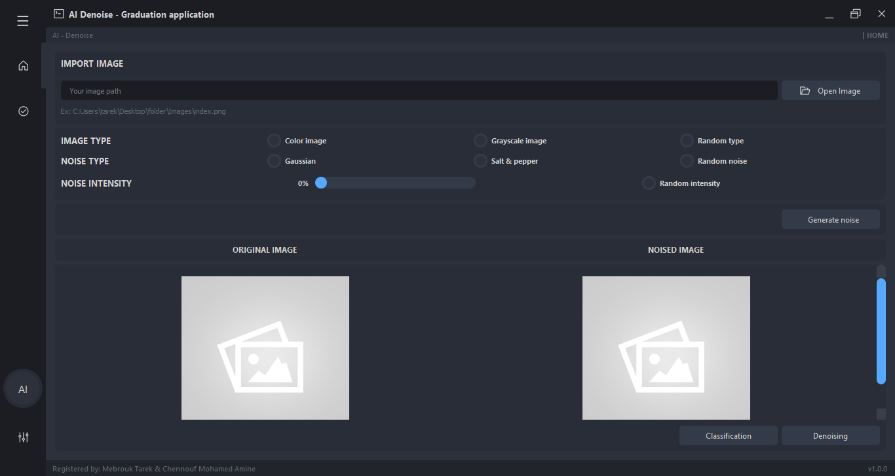
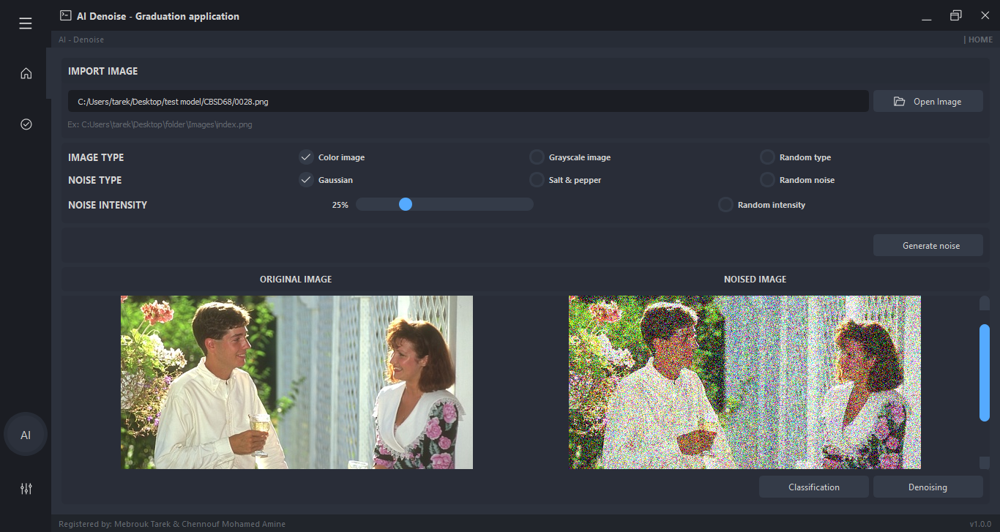
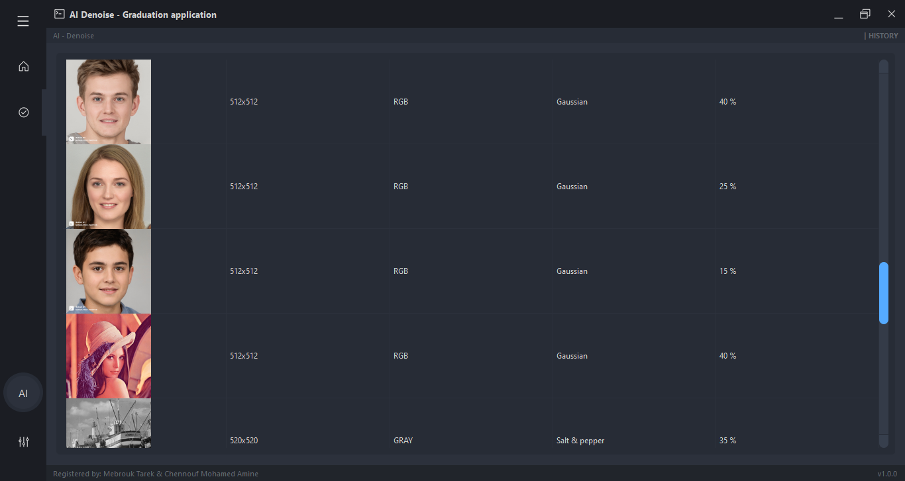
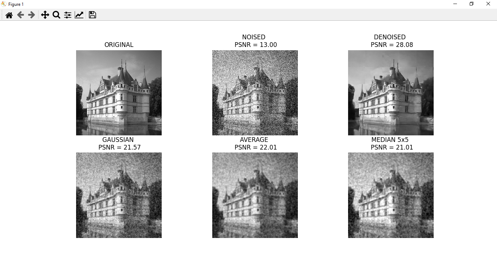
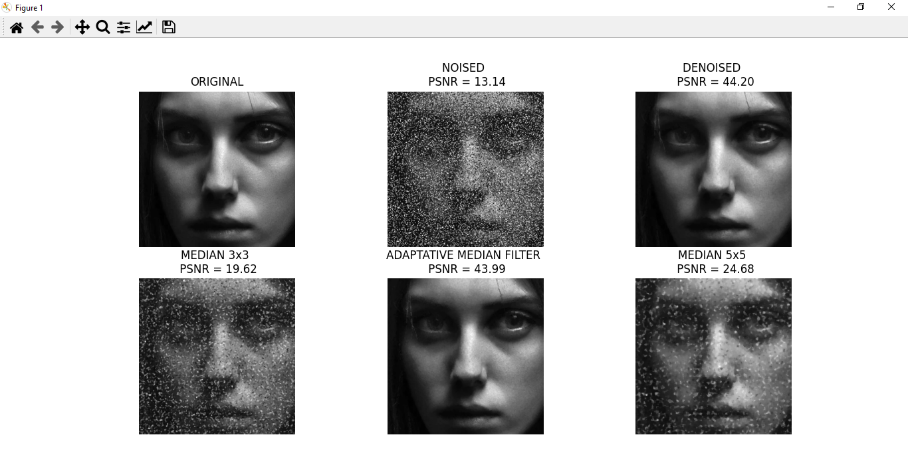

<H1> Image Classification and Denoising for gaussian and salt & pepper noise using python </h1>

  <H6> University of Science and Technology USTHB </H6>
  <H6> IT department </H6>
  <H6> End-of-study project in license year (2020/2021) </H6>

<H3> System requirement : </H3>
<ul>
 <li> <H4> Python </H4> </li> 
 <li> <H4> TensorFlow & keras </H4> </li> 
 <li> <H4> PyQt5 & PySide2 </H4> </li>  
</ul>

<H3> Software screens : </H3>
<ul>
 <li> <H4> Upload Testing image </H4> </li> 
      
 <li> <H4> Generate noise for testing image </H4> </li> 
      
 <li> <H4> Executions history </H4> </li> 
      
 <li> <H4> Image result for gaussian color image denoising </H4> </li> 
      
 <li> <H4> Image result for gaussian gray image denoising </H4> </li> 
      
 <li> <H4> Image result for salt & pepper gray image denoising </H4> </li> 
      
</ul>
